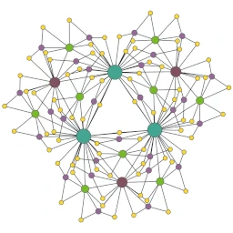

# A Graph A Day

This is a Twitter bot which tweets pictures of random graphs.

There is a short [blog article](https://blog.schawe.me/randomGraphs.html) about the tech and -- more importantly -- showing a few example pictures.

The bot can also listen for mentions and answers them with pictures of graphs
it detects in the tweet. The layout ans styles are also extracted from the
tweet if possible. If a number smaller than 1025 is detected, it is used as
the number of nodes.

## Selection of Recognized Keywords

### Graph Types

    * Watts-Strogatz
    * Barabási-Albert
    * Powerlaw cluster graph
    * Delaunay triangulation and some subgraphs
    * Minimum Radius graph
    * some real world networks (source: http://www-personal.umich.edu/~mejn/netdata/)
    * Caveman graph

### Styles

    * Betweenness
        * dark background
        * node color and size dependent on betweenness centrality
        * edge thickness dependent on betweenness centrality

    * Degree
        * white background
        * node size and color dependent on their degree

    * Blocky
        * dark background
        * square nodes
        * node color dependent on their eigenvector

    * Curved
        * white background
        * curved edges
        * node size and color dependent on their HITS score assuming the graph
          is a citation network

### Layouts

    * sfdp
    * Fruchterman Reingold (spring based layout)
    * ARF (attractive and repulsive forces, nodes inside a disk)
    * radial tree
    * blockmodel (stochastic blockmodel based hirachic layout)
    * dot (from graphviz, a hierarchic layout)
    * neato (from graphviz also known as Kamada-Kawai)
    * circular (from graphviz, nodes on a circle)
    * twopi (from graphviz, radial layout)

## Setup

Every time the program runs it will create a graph, save it as `png`
and its details in a `txt` named after the current unix timestamp and tweets
it.

**Important:** Do not forget to put in valid keys and secrets in `keys_and_secrets.py`.

Also there is at least one submodule which should be loaded from GitHub,
therefore run `git submodule update --init --recursive` after cloning.

## Dependencies

    * from PyPI
        * networkx
        * matplotlib
        * scipy
        * python-pygraphviz
        * tweepy
        * fuzzywuzzy
        * graph-tool

    * Imagemagick
    * optipng
